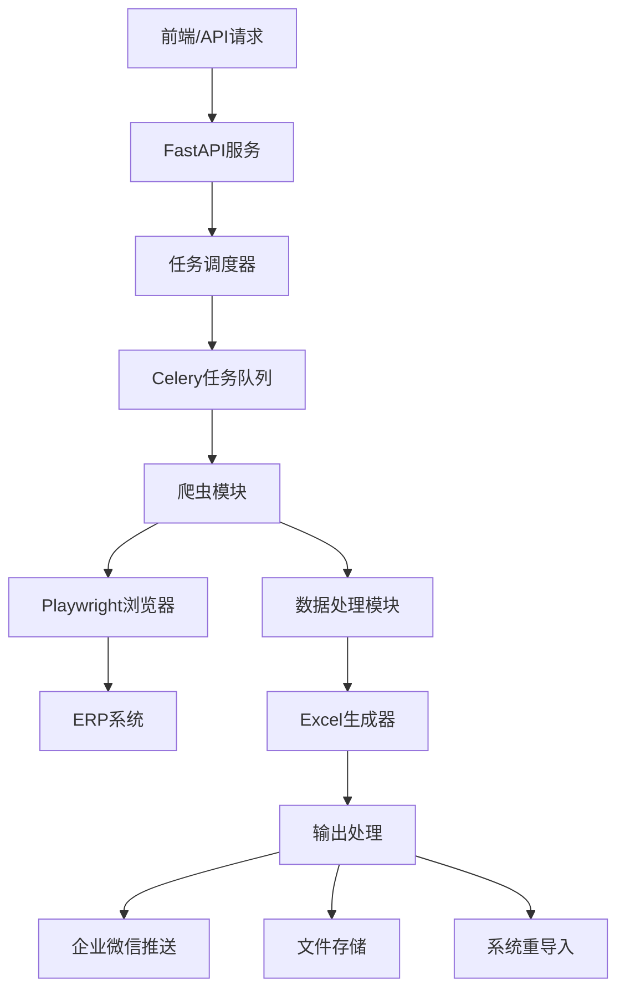

# SCZY ERP数据爬取系统 - 项目规划

## 项目概述

构建一个模块化的ERP数据爬取和处理系统，通过Playwright自动化操作获取第三方ERP数据，处理成Excel等格式，支持多种输出方式。

## 技术架构

### 核心技术栈
- **后端框架**: FastAPI (高性能、自动文档生成、异步支持)
- **爬虫引擎**: Playwright (现代、稳定、高性能)
- **数据处理**: Pandas + openpyxl + XlsxWriter
- **任务队列**: Celery + Redis (异步任务管理)
- **企业微信**: 自定义Webhook集成
- **配置管理**: Pydantic Settings + python-dotenv
- **日志系统**: structlog + loguru

### 系统架构图

## 模块设计

### 1. 爬虫模块 (app/crawlers/)
- **BaseCrawler**: 基础爬虫类，提供通用功能
- **ERPAuthCrawler**: 登录认证模块
- **业务爬虫**: 继承BaseCrawler，实现具体业务逻辑

### 2. API接口 (app/api/)
- **健康检查**: 服务状态监控
- **爬虫管理**: 任务创建、状态查询、结果获取
- **数据管理**: 文件上传下载、历史记录

### 3. 数据处理 (app/processors/)
- **Excel处理**: 数据清洗、格式转换、公式样式
- **数据验证**: 完整性检查、异常处理
- **数据转换**: 透视、聚合、计算

### 4. 输出处理 (app/outputs/)
- **企业微信**: 消息推送、文件分享
- **文件管理**: 存储、下载、清理
- **系统导入**: 批量更新、表单填写

## 实施阶段

### 第一阶段：基础架构 (已完成)
- [x] 项目结构搭建
- [x] 依赖配置
- [x] 基础配置系统
- [x] FastAPI框架
- [x] 基础爬虫类

### 第二阶段：核心功能开发
- [ ] 认证模块完善
- [ ] 示例业务爬虫
- [ ] 数据处理引擎
- [ ] 任务队列系统

### 第三阶段：输出集成
- [ ] 企业微信集成
- [ ] 文件管理系统
- [ ] 系统重导入功能

### 第四阶段：测试与优化
- [ ] 单元测试
- [ ] 集成测试
- [ ] 性能优化
- [ ] 错误处理完善

## 关键技术决策

### 1. 为什么选择Playwright？
- **稳定性**: 相比Selenium更稳定，处理现代Web应用更好
- **性能**: 异步支持，执行速度更快
- **功能丰富**: 自动等待、网络拦截、反检测等功能

### 2. 为什么选择FastAPI？
- **异步支持**: 与爬虫异步特性完美匹配
- **自动文档**: 自动生成OpenAPI文档
- **类型检查**: Pydantic提供强类型支持
- **性能**: 高性能的异步框架

### 3. 模块化设计原则
- **单一职责**: 每个爬虫模块只负责特定业务
- **可组合性**: 支持多个爬虫模块组合使用
- **可扩展性**: 易于添加新的业务爬虫
- **可维护性**: 清晰的代码结构和文档

## 风险评估

### 技术风险
- **反爬机制**: ERP系统可能有反爬虫检测
- **页面变更**: ERP系统界面变更可能影响爬虫稳定性
- **性能问题**: 大量并发任务可能影响系统性能

### 缓解措施
- **反反爬**: 使用playwright-stealth、随机延时等
- **监控告警**: 实时监控爬虫状态，及时发现问题
- **优雅降级**: 提供备用方案和错误恢复机制

## 成功指标

### 功能指标
- [x] 基础框架搭建完成
- [ ] 支持3种以上业务数据爬取
- [ ] 支持Excel、图片等多种输出格式
- [ ] 企业微信推送功能正常
- [ ] 系统重导入功能正常

### 性能指标
- [ ] 单个爬虫任务平均完成时间 < 5分钟
- [ ] 系统可用性 > 99%
- [ ] 错误率 < 1%
- [ ] 支持10个并发任务

### 质量指标
- [ ] 代码测试覆盖率 > 80%
- [ ] 所有API有完整文档
- [ ] 错误日志记录完整
- [ ] 配置管理系统完善